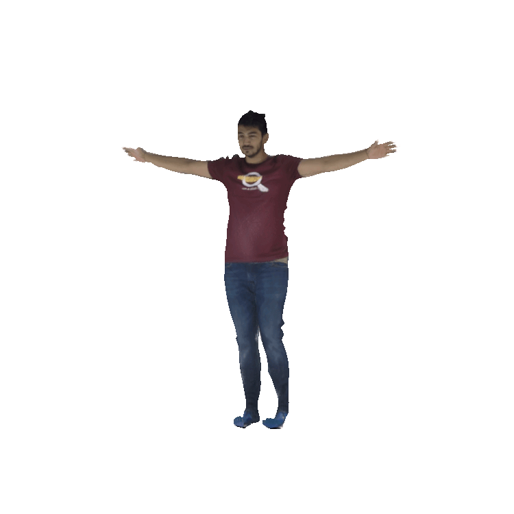

# Humbi Textured Meshes

This repository provides a neural rendering method for constructing **textured deformed SMPL-X meshes** for subjects in the [HUMBI](https://github.com/zhixuany/HUMBI) dataset.

  

## Demo and pre-installations

The whole method can be run from the provided `humbi_textured_meshes.ipynb` notebook, either locally or in [this Colab notebook](https://colab.research.google.com/drive/1Alj4ZPxb7VC6EYSfWOgG9NjYLN4iHAWw?usp=sharing).

> :warning: No GPU is required, however we strongly recommend to run the notebook with GPU acceleration to speedup the optimization process. If run locally, we advise to follow the installation instructions below, rather than the one provided in the notebook itself, as some packages have dependencies on specific PyTorch and CUDA versions.

Download _SMPL-X models_ (`SMPLX_{MALE,FEMALE,NEUTRAL}.pkl`) and the corresponding _SMPL-X UV map_ from the [SMPL-X project](https://smpl-x.is.tue.mpg.de) page. Combine all the SMPL-X data inside a single `smplx/` folder. If you run the notebook from Google Colab, move the `smplx/` folder to your Google Drive, and specify the path to your drive (the exact location where you moved the folder) at the top of the notebook. If you plan on running the notebook locally, move the `smplx/` folder inside of this repository (`humbi_textured_meshes/`), and run the notebook from within this repository.
 
If you want to run the method by executing the python scripts directly, first proceed witt the installations in the section below. You can then execute the basic neural rendering for subject 1 and 2 from [HUMBI](https://github.com/zhixuany/HUMBI) as an example with
```bash
python3 main.py --subjects '[1, 2]'
```
Further explanations on how to run the method with additional optional flags are provided in the notebook.


## Installations

You can skip the following steps if you run the notebook on Google Colab.

Clone this repository and install the dependencies with
```bash
git clone https://github.com/maximeraafat/humbi_textured_meshes.git
pip install -r humbi_textured_meshes/requirements.txt
```

and install the below packages
- PyTorch3D : https://github.com/facebookresearch/pytorch3d/blob/main/INSTALL.md
- Detectron2 : https://github.com/facebookresearch/detectron2/blob/main/INSTALL.md

Additionally, clone [Detectron2](https://github.com/facebookresearch/detectron2) (if not already done) inside of this repository (`humbi_textured_meshes/`)
```bash
git clone https://github.com/facebookresearch/detectron2.git detectron2_repo
```

(the whole pipeline is implemented using [PyTorch3D](https://pytorch3d.org), and [Detectron2](https://github.com/facebookresearch/detectron2) is used for person segmentation in the ground truth imagery provided by [HUMBI](https://github.com/zhixuany/HUMBI))


## Tested modules
Note that we encountered some _CUDA_ issues if the versions for [PyTorch](https://pytorch.org) and [PyTorch3D](https://pytorch3d.org) do not properly match. Below you can find the installation commands for the versions we tested
```bash
pip install torch==1.10.0+cu111 torchvision==0.11.1+cu111 torchaudio==0.10.0+cu111 -f https://download.pytorch.org/whl/cu111/torch_stable.html
pip install pytorch3d -f https://dl.fbaipublicfiles.com/pytorch3d/packaging/wheels/py39_cu111_pyt1100/download.html
```

## Apply textures onto SMPL-X mesh (in Blender)
The output of the neural rendering consists of color appearance textures as well as displacement textures, which can be applied to a rigged SMPL-X mesh via a [Blender](https://www.blender.org) add-on (available to download on [SMPL-X project](https://smpl-x.is.tue.mpg.de) page). Once the SMPL-X mesh loaded in Blender, proceed as follows in order to apply the textures properly:
- Displacement texture map : _Activate Displace Modifier > New Texture (load texture file) > Coordinates : UV > Direction : RGB to XYZ_
- RGB texture map : _Shader Editor > Load Image Texture (load texture file) > Plug in to Principled BSDF base color > Specular to 0.0 and Roughness to 1.0_

> Note that we tested this in Blender 3.0, previous or following versions might have a slightly different proceedure.


## License
This library is licensed under the MIT License. See the [LICENSE](LICENSE) file.


<!-- 
TODO

* Remove tmp_docs folder (but keep tmp_files -> tmp folder)

* Nice visualizations : images and gifs of reconstructed subjects -> see Term Paper Presentation material

-->
